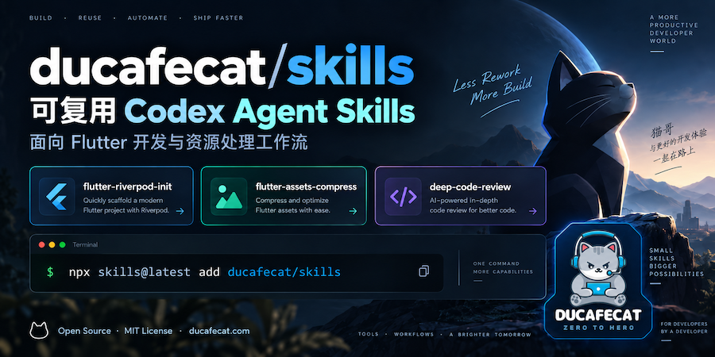

<p align="center">
  
</p>

[English](./README.md) | [简体中文](./README.zh-CN.md) | [繁體中文](./README.zh-TW.md)

# 猫哥 Flutter Agent Skills for Codex, Claude Code & Cursor

为 Flutter 开发者打造的可复用 AI Agent Skills，面向 **Codex、Claude Code、Cursor** 等 AI 编程工具，涵盖 Riverpod / GetX 项目初始化、图片资源自动化和深度代码审查。

为已有 Flutter 应用加入 go_router、Dio、Freezed、存储与主题，使用贴合仓库规范的指令完成资源处理和代码审查。

官网：[ducafecat.com](https://ducafecat.com)

## 快速开始

在项目目录中运行：

```bash
npx skills@latest add ducafecat/skills
```

按安装器提示选择所需技能和目标 AI 编程 Agent。技能会作为普通文件安装，可以直接查看和修改。

更新已安装的技能：

```bash
npx skills update
```

初始化技能需要已有 Flutter 项目，包含 `pubspec.yaml` 和 `lib/main.dart`。图片资源技能需要 `assets/images/3.0x/` 下的源图。执行项目命令需要 Flutter 或 Dart SDK；安装依赖时可能需要网络访问。

## 为什么使用 Flutter Agent Skills？

- **可复用的项目初始化流程：** 按 Riverpod 或 GetX 架构说明与文件模板，搭建基础页面流程。
- **自动化资源处理：** 使用纯 Dart 生成多倍率图片，并维护 `AppImages` 资源索引。
- **基于仓库事实的代码审查：** 结合仓库标准与审查规则，核查代码变更。
- **可修改的工作流：** 技能指令、参考文档和配套文件均保存在仓库中。

## 可用 Flutter 技能

| 技能 | 功能 | 文档 |
| --- | --- | --- |
| [`flutter-riverpod-init`](./skills/flutter-riverpod-init/SKILL.md) | 为已有 Flutter 项目加入 Riverpod、go_router、Dio、Freezed/JSON、SharedPreferences、Logger、AdaptiveTheme 和基础页面。 | [使用指南](./skills/flutter-riverpod-init/README.md) |
| [`flutter-getx-init`](./skills/flutter-getx-init/SKILL.md) | 加入 GetX 应用基础设施、路由、网络、存储、主题、英文/简体/繁体多语言，以及 DucafeUI 组件库和离线文档。 | [使用指南](./skills/flutter-getx-init/README.md) |
| [`flutter-assets-compress`](./skills/flutter-assets-compress/SKILL.md) | 基于 `assets/images/3.0x/` 源图，用纯 Dart 生成 Flutter 1x、2x 图片，压缩支持的输出格式，并更新 `AppImages` 索引。 | [使用指南](./skills/flutter-assets-compress/README.md) |
| [`deep-code-review`](./skills/deep-code-review/SKILL.md) | 结合仓库标准与审查规则，审查分支、PR、指定基准或工作区代码变更；自动触发时按规模与风险选择审查深度。 | [技能入口](./skills/deep-code-review/SKILL.md) |

## 支持的 AI 编程工具

通过 skills CLI 为 **OpenAI Codex、Claude Code、Cursor** 安装技能，并按安装器提供的选项选择目标 Agent。调用方式和自动发现能力取决于所使用的工具。

下方示例使用 Codex 风格的 `$技能名称` 调用。在其他 Agent 中，请使用其技能选择方式，或在任务中明确指定技能名称。具体工作流可能需要命令执行、子 Agent 等能力，使用前请查看对应的 `SKILL.md`。

## Flutter 技术栈

| 领域 | 库与工具 |
| --- | --- |
| 语言与框架 | Dart、Flutter |
| 状态管理 | Riverpod 或 GetX |
| 路由与网络 | go_router、Dio |
| 模型与代码生成 | Freezed、JSON 序列化、build_runner |
| 存储、日志与主题 | SharedPreferences、Logger、AdaptiveTheme |
| GetX UI 与多语言 | DucafeUI、GetX translations（en / zh-CN / zh-TW） |
| 图片资源自动化 | 纯 Dart 图片处理、`AppImages` 索引 |

## 使用示例

### Flutter Riverpod 项目初始化

```text
$flutter-riverpod-init
```

参考[架构说明](./skills/flutter-riverpod-init/references/architecture.md)和[文件模板](./skills/flutter-riverpod-init/references/file-templates.md)。

### Flutter GetX 项目初始化

```text
$flutter-getx-init
```

参考[架构说明](./skills/flutter-getx-init/references/architecture.md)和[文件模板](./skills/flutter-getx-init/references/file-templates.md)。流程包含启动页、欢迎页、登录页、首页，以及离线组件说明和样式规范。

### Flutter 图片资源生成

```text
$flutter-assets-compress
```

参考[资源生成指南](./skills/flutter-assets-compress/README.md)。

### 深度代码审查

```text
$deep-code-review
```

也可以指定分支或 `main` 等比较基准。参考[审查标准](./skills/deep-code-review/references/standards.md)。该技能不审查 Markdown 和文档路径。

## Agent Skills 如何工作

[`skills/`](./skills/) 下的每个技能目录均包含 `SKILL.md`，定义用途、触发条件和执行流程，并可附带参考文档、模板、资源或辅助脚本。编程 Agent 读取这些指令并应用到项目；支持自动发现的 Agent 也可以根据任务上下文选择匹配的技能。

使用前请阅读对应技能的指令。工作流可能修改项目文件，并执行 `flutter pub add`、`dart run`、`flutter analyze`、`flutter test` 或 `build_runner` 等本地命令。

## 仓库结构

```text
.
├── skills/
│   ├── flutter-riverpod-init/   # SKILL.md、README.md、references/
│   ├── flutter-getx-init/       # SKILL.md、README.md、assets/、references/
│   ├── flutter-assets-compress/ # SKILL.md、README.md
│   └── deep-code-review/        # SKILL.md、agents/、references/、scripts/
├── CHANGELOG.md
├── CONTRIBUTING.md
├── LICENSE
├── README.md                   # 英文
├── README.zh-CN.md              # 简体中文
└── README.zh-TW.md              # 繁体中文
```

## 贡献

技能结构和验证要求见 [CONTRIBUTING.md](./CONTRIBUTING.md)。发布技能变更前，请检查 front matter、目录名与技能名称的一致性、参考链接，并同步技能版本和 [CHANGELOG.md](./CHANGELOG.md)。

修改 README 时，请同步维护英文、简体中文和繁体中文版本。链接指向的技能文档保留其原始语言。

## 许可证

本仓库基于 [MIT License](./LICENSE) 开源。
